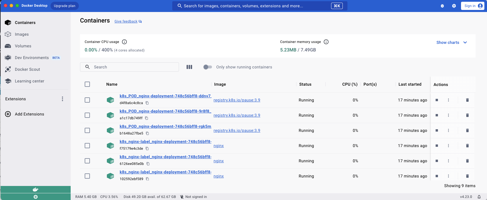
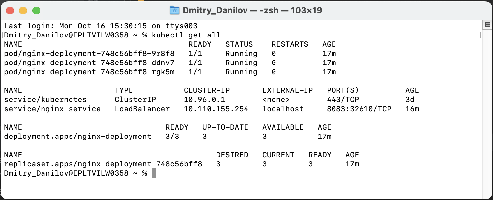

# kubectl-test
### Description:
- use **nginx**
- test **Kubernetes** (Docker desktop)

Create or update the deployment in the cluster:
```
kubectl apply -f k8s-deployment.yaml
```

List all the pods running in a cluster:
```
kubectl get pods
```

Create or update the service in the cluster:
```
 k8s-service.yaml
```

List all the resources of all types in a namespace:
```
kubectl get all
```

[](readme-assets/console.png.png)

**nginx** available on: `http://localhost:8083`

```
            port: 8083     targetPort: 80
  Request ----> Service ----> Pod
                                 containerPort: 80
```


Stop all services and pods in a Kubernetes cluster:
```
kubectl delete deployments --all
```
```
kubectl delete statefulsets --all
```
```
kubectl delete daemonsets --all
```
```
kubectl delete services --all
```
```
kubectl delete pods --all
```

```
kubectl apply -f k8s-manifests.yaml
```
```
kubectl config view
kubectl cluster-info dump
kubectl cluster-info
```